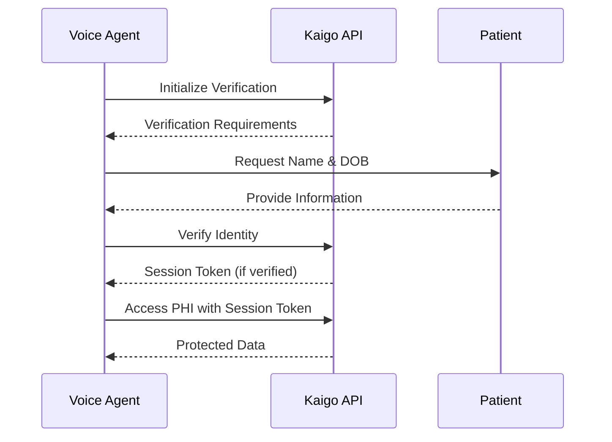

## Overview

The Kaigo API uses a multi-layered authentication approach to ensure HIPAA compliance and secure access to Protected Health Information (PHI).

<Warning>
  **Important**: Phone number verification alone is NOT sufficient for PHI access. Two-factor patient verification is required.
</Warning>

## Authentication Layers

### 1. Service Authentication

All API requests require service-level authentication using a bearer token.

<CodeGroup>

```bash cURL
curl -X GET https://api.kaigo.com/api/v1/admin/calls/scheduled \
  -H "Authorization: Bearer YOUR_API_TOKEN" \
  -H "X-Service-ID: YOUR_SERVICE_ID"
```

```javascript Node.js
const response = await fetch('https://api.kaigo.com/api/v1/admin/calls/scheduled', {
  headers: {
    'Authorization': 'Bearer YOUR_API_TOKEN',
    'X-Service-ID': 'YOUR_SERVICE_ID'
  }
});
```

```python Python
import requests

response = requests.get(
    'https://api.kaigo.com/api/v1/admin/calls/scheduled',
    headers={
        'Authorization': 'Bearer YOUR_API_TOKEN',
        'X-Service-ID': 'YOUR_SERVICE_ID'
    }
)
```

</CodeGroup>

### 2. Patient Session Authentication

To access PHI, you must first verify the patient's identity and obtain a session token.



## Patient Verification Flow

### Step 1: Initialize Verification

Start the verification process with the patient's phone number:

```javascript
const initResponse = await fetch('https://api.kaigo.com/api/v1/admin/patients/initialize-verification', {
  method: 'POST',
  headers: {
    'Authorization': 'Bearer YOUR_API_TOKEN',
    'Content-Type': 'application/json'
  },
  body: JSON.stringify({
    phone_number: '+15551234567',
    call_sid: 'CALL_123456',
    call_type: 'RPM_OUTBOUND',
    call_direction: 'outbound'
  })
});

const { verification_session_id, verification_required } = await initResponse.json();
// verification_required: ['name', 'date_of_birth']
```

### Step 2: Verify Patient Identity

Submit the verification data collected from the patient:

```javascript
const verifyResponse = await fetch('https://api.kaigo.com/api/v1/admin/patients/verify-identity', {
  method: 'POST',
  headers: {
    'Authorization': 'Bearer YOUR_API_TOKEN',
    'Content-Type': 'application/json'
  },
  body: JSON.stringify({
    verification_session_id: 'SESSION_ID_FROM_STEP_1',
    verification_data: {
      name: 'John Doe',
      date_of_birth: '1950-01-15'
    }
  })
});

const { patient_session_token, patient_id, expires_at } = await verifyResponse.json();
```

### Step 3: Access PHI with Session Token

Use the session token to access protected endpoints:

```javascript
const patientData = await fetch(`https://api.kaigo.com/api/v1/admin/patients/${patient_id}/medical`, {
  headers: {
    'Authorization': 'Bearer YOUR_API_TOKEN',
    'X-Patient-Session': patient_session_token
  }
});
```

## Session Management

### Session Expiration

- Sessions automatically expire after **15 minutes** of inactivity
- The `expires_at` field indicates the exact expiration time
- Expired sessions return a `410 Gone` status

### Manual Session Revocation

Revoke a session immediately when:
- The call ends
- The patient requests disconnection
- Suspicious activity is detected

```javascript
await fetch(`https://api.kaigo.com/api/v1/admin/sessions/${session_token}`, {
  method: 'DELETE',
  headers: {
    'Authorization': 'Bearer YOUR_API_TOKEN'
  }
});
```

## Security Headers

| Header | Required | Description |
|--------|----------|-------------|
| `Authorization` | Yes | Bearer token for service authentication |
| `X-Service-ID` | Yes* | Service identifier (*for some endpoints) |
| `X-Patient-Session` | Conditional | Required for PHI access endpoints |
| `X-Idempotency-Key` | Recommended | Prevents duplicate operations |

## Error Responses

### Authentication Errors

```json
{
  "error": "invalid_session",
  "message": "The patient session token is invalid or has expired"
}
```

Common authentication error codes:

| Code | Description |
|------|-------------|
| `401` | Invalid or missing bearer token |
| `403` | Session doesn't authorize this patient/call |
| `410` | Session expired |
| `429` | Too many verification attempts |

## Best Practices

<AccordionGroup>
  <Accordion title="Store tokens securely">
    Never log or store patient session tokens in plain text. Use secure storage mechanisms and encrypt at rest.
  </Accordion>
  
  <Accordion title="Implement retry logic">
    Handle verification failures gracefully with exponential backoff. Maximum 5 attempts per 15-minute window.
  </Accordion>
  
  <Accordion title="Revoke sessions promptly">
    Always revoke sessions when calls end or if any security concerns arise.
  </Accordion>
  
  <Accordion title="Monitor session expiration">
    Track the `expires_at` timestamp and refresh sessions before expiration if needed.
  </Accordion>
</AccordionGroup>

## Next Steps

<CardGroup cols={2}>
  <Card
    title="HIPAA Compliance"
    icon="shield"
    href="/guides/hipaa-compliance"
  >
    Learn about our HIPAA security measures
  </Card>
  <Card
    title="Patient Verification Guide"
    icon="user-check"
    href="/guides/patient-verification"
  >
    Detailed verification implementation guide
  </Card>
</CardGroup>