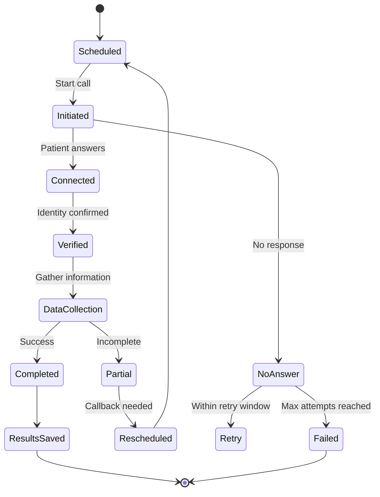

## Overview

The Kaigo Platform provides robust call management capabilities for healthcare voice agents, including scheduling, tracking, and result storage with full HIPAA compliance.

## Call Types

The API supports multiple call types for different healthcare scenarios:

<Tabs>
  <Tab title="RPM Outbound">
    **Remote Patient Monitoring - Outbound**
    - Scheduled daily check-ins
    - Vital signs collection
    - Symptom tracking
    - Medication adherence
  </Tab>
  <Tab title="RPM Inbound">
    **Remote Patient Monitoring - Inbound**
    - Patient-initiated calls
    - On-demand vital reporting
    - Urgent symptom reporting
  </Tab>
  <Tab title="Appointment Reminder">
    **Appointment Management**
    - Pre-visit reminders
    - Confirmation requests
    - Rescheduling options
    - Preparation instructions
  </Tab>
  <Tab title="Follow-up">
    **Post-Visit Follow-up**
    - Discharge instructions
    - Recovery monitoring
    - Care plan adherence
    - Satisfaction surveys
  </Tab>
</Tabs>

## Call Lifecycle



## Getting Call Context

Before initiating a call, retrieve the context to understand what data to collect:

```javascript
const callContext = await fetch(
  `https://api.kaigo.com/api/v1/admin/calls/${callId}/context`,
  {
    headers: {
      'Authorization': `Bearer ${API_TOKEN}`
    }
  }
);

const context = await callContext.json();
// {
//   call_type: "RPM_OUTBOUND",
//   data_to_collect: ["blood_pressure", "blood_glucose", "weight"],
//   special_instructions: "Patient prefers morning calls",
//   language_preference: "en"
// }
```

## Saving Call Results

After completing a call, save the results with collected data:

```javascript
const saveResults = await fetch(
  'https://api.kaigo.com/api/v1/admin/calls/results',
  {
    method: 'POST',
    headers: {
      'Authorization': `Bearer ${API_TOKEN}`,
      'X-Patient-Session': sessionToken,
      'X-Idempotency-Key': callSid // Prevent duplicates
    },
    body: JSON.stringify({
      patient_id: patientId,
      call_sid: callSid,
      call_id: callId,
      call_timestamp: new Date().toISOString(),
      call_duration_seconds: 245,
      call_type: 'RPM_OUTBOUND',
      call_status: 'COMPLETED',
      patient_verified: true,
      vitals_collected: {
        blood_pressure: {
          systolic: 120,
          diastolic: 80,
          timestamp: '2024-01-15T09:30:00Z'
        },
        blood_glucose: {
          value: 95,
          fasting: true,
          timestamp: '2024-01-15T09:31:00Z'
        }
      },
      symptoms_reported: ['none'],
      medication_adherence: {
        metformin: 'taken',
        lisinopril: 'taken'
      },
      follow_up_required: false,
      ai_summary: 'Patient reports feeling well. Vitals within normal range.'
    })
  }
);
```

## Call Status Management

Update call status throughout the lifecycle:

```javascript
async function updateCallStatus(callId, status, details = {}) {
  return await fetch(
    `https://api.kaigo.com/api/v1/admin/calls/${callId}/status`,
    {
      method: 'PATCH',
      headers: {
        'Authorization': `Bearer ${API_TOKEN}`,
        'Content-Type': 'application/json'
      },
      body: JSON.stringify({
        status: status,
        call_sid: details.callSid,
        outcome: details.outcome,
        duration_seconds: details.duration,
        attempt_number: details.attemptNumber,
        failure_reason: details.failureReason,
        next_action: details.nextAction
      })
    }
  );
}

// Examples
await updateCallStatus(callId, 'initiated', { callSid });
await updateCallStatus(callId, 'connected', { callSid });
await updateCallStatus(callId, 'completed', { 
  callSid,
  outcome: 'successful',
  duration: 300
});
```

## Scheduling & Rescheduling

### Get Scheduled Calls

```javascript
const scheduled = await fetch(
  'https://api.kaigo.com/api/v1/admin/calls/scheduled?' + 
  new URLSearchParams({
    date: '2024-01-15',
    time_window: '09:00-12:00',
    call_type: 'RPM',
    status: 'pending',
    limit: 50
  }),
  {
    headers: {
      'Authorization': `Bearer ${API_TOKEN}`
    }
  }
);
```

### Reschedule a Callback

When a patient needs to be called back:

```javascript
const reschedule = await fetch(
  'https://api.kaigo.com/api/v1/admin/calls/reschedule',
  {
    method: 'POST',
    headers: {
      'Authorization': `Bearer ${API_TOKEN}`,
      'X-Patient-Session': sessionToken
    },
    body: JSON.stringify({
      patient_id: patientId,
      original_call_sid: callSid,
      reschedule_reason: 'post_meal', // After eating for glucose test
      reschedule_type: 'short_delay',
      preferred_callback_time: '2024-01-15T11:00:00Z',
      data_to_collect: ['blood_glucose'],
      partial_data: {
        blood_pressure: { systolic: 120, diastolic: 80 }
      }
    })
  }
);
```

## Retry Logic

Implement intelligent retry logic for failed calls:

```javascript
class CallRetryManager {
  constructor(maxAttempts = 3, retryIntervals = [15, 30, 60]) {
    this.maxAttempts = maxAttempts;
    this.retryIntervals = retryIntervals; // minutes
  }

  async attemptCall(callId, attemptNumber = 1) {
    try {
      const result = await makeCall(callId);
      
      if (result.status === 'no_answer' && attemptNumber < this.maxAttempts) {
        const delayMinutes = this.retryIntervals[attemptNumber - 1];
        
        await this.scheduleRetry(callId, delayMinutes);
        
        return {
          status: 'retry_scheduled',
          next_attempt: attemptNumber + 1,
          retry_in: delayMinutes
        };
      }
      
      return result;
    } catch (error) {
      await this.handleCallError(callId, error);
    }
  }

  async scheduleRetry(callId, delayMinutes) {
    const retryTime = new Date();
    retryTime.setMinutes(retryTime.getMinutes() + delayMinutes);
    
    await updateCallStatus(callId, 'rescheduled', {
      next_action: 'retry_later',
      notes: `Retry scheduled for ${retryTime.toISOString()}`
    });
  }
}
```

## Priority Management

Handle calls based on priority:

| Priority | Use Case | Response Time |
|----------|----------|---------------|
| **Critical** | Abnormal vitals, severe symptoms | Immediate |
| **Urgent** | Missed medications, moderate symptoms | Within 1 hour |
| **Routine** | Regular check-ins, reminders | Scheduled window |

## Call Recording & Transcripts

<Warning>
  Call recordings containing PHI must be encrypted and access-controlled per HIPAA requirements.
</Warning>

Store recording and transcript URLs securely:

```javascript
{
  recording_url: "https://secure-storage.kaigo.com/recordings/[encrypted-id]",
  transcript_url: "https://secure-storage.kaigo.com/transcripts/[encrypted-id]",
  retention_days: 30,
  access_requires: ["patient_session", "audit_log"]
}
```

## Best Practices

<AccordionGroup>
  <Accordion title="Always use idempotency keys">
    Use the call SID as an idempotency key to prevent duplicate result submissions.
  </Accordion>
  
  <Accordion title="Handle partial data gracefully">
    If a call is interrupted, save partial data and schedule a callback for remaining items.
  </Accordion>
  
  <Accordion title="Implement circuit breakers">
    Stop attempting calls to unreachable patients after repeated failures.
  </Accordion>
  
  <Accordion title="Monitor call quality metrics">
    Track connection rates, completion rates, and average duration for optimization.
  </Accordion>
  
  <Accordion title="Use appropriate timeouts">
    Set reasonable timeouts for different call types (e.g., 5 min for quick check-ins, 15 min for detailed assessments).
  </Accordion>
</AccordionGroup>

## Error Handling

Handle common call errors appropriately:

```javascript
function handleCallError(error) {
  switch(error.code) {
    case 'PATIENT_UNREACHABLE':
      return scheduleRetry();
      
    case 'TECHNICAL_FAILURE':
      return notifySupport();
      
    case 'VERIFICATION_FAILED':
      return logSecurityEvent();
      
    case 'SESSION_EXPIRED':
      return reverifyPatient();
      
    default:
      return escalateToHuman();
  }
}
```

## Next Steps

<CardGroup cols={2}>
  <Card
    title="Session Management"
    icon="key"
    href="/guides/session-management"
  >
    Learn about managing patient sessions
  </Card>
  <Card
    title="Escalation Handling"
    icon="triangle-exclamation"
    href="/guides/escalation-handling"
  >
    Handle critical situations and escalations
  </Card>
</CardGroup>