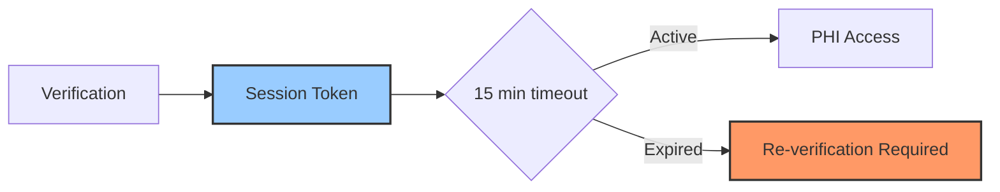

## Overview

The Kaigo Platform Healthcare API is designed with HIPAA compliance at its core. Every aspect of our API ensures the security and privacy of Protected Health Information (PHI) in accordance with HIPAA regulations.

<Note>
  All API consumers must sign a Business Associate Agreement (BAA) before accessing production endpoints.
</Note>

## Key Security Measures

### 1. Two-Factor Patient Verification

<Warning>
  Phone number alone is NEVER sufficient for PHI access. Two-factor verification is mandatory.
</Warning>

Our verification process requires:
- **Factor 1**: Patient's full name
- **Factor 2**: Date of birth

This ensures that even if a phone number is compromised, PHI remains protected.

### 2. Session-Based PHI Access



**Session characteristics:**
- Time-limited (15 minutes)
- Scoped to specific patient and call
- Single-use for sensitive operations
- Automatic expiration on inactivity

### 3. Comprehensive Audit Logging

Every API interaction is logged with:

| Data Point | Purpose |
|------------|---------|
| Timestamp | When access occurred |
| Patient ID | Who was accessed |
| Session ID | Authorization context |
| Operation | What was accessed/modified |
| IP Address | Where request originated |
| User Agent | System making request |
| Response Code | Success/failure status |

### 4. Data Encryption

<Tabs>
  <Tab title="In Transit">
    - **TLS 1.3** minimum for all connections
    - Certificate pinning available
    - Perfect Forward Secrecy (PFS)
  </Tab>
  <Tab title="At Rest">
    - **AES-256** encryption for database
    - Encrypted backups
    - Key rotation every 90 days
  </Tab>
  <Tab title="In Processing">
    - Memory encryption for sensitive data
    - Secure key management (HSM)
    - No PHI in logs or error messages
  </Tab>
</Tabs>

## Access Controls

### Role-Based Access Control (RBAC)

```json
{
  "voice_agent": {
    "can_read": ["demographics", "vitals", "medications"],
    "can_write": ["call_results", "vitals_collected"],
    "cannot_access": ["billing", "insurance_details"]
  }
}
```

### Minimum Necessary Standard

The API enforces the HIPAA minimum necessary standard:

- Endpoints return only requested fields
- Default responses exclude sensitive data
- Explicit field selection required for PHI

Example:
```javascript
// Only returns requested fields
GET /api/v1/admin/patients/{id}/medical?sections=medications,conditions

// Not allowed - must specify sections
GET /api/v1/admin/patients/{id}/medical
```

## Physical & Administrative Safeguards

### Infrastructure Security

- **Data Centers**: SOC 2 Type II certified
- **Geographic Redundancy**: Multi-region deployment
- **Disaster Recovery**: RPO < 1 hour, RTO < 4 hours
- **Penetration Testing**: Quarterly third-party assessments

### Administrative Controls

- Background checks for all personnel
- Regular HIPAA training (annual)
- Incident response procedures
- Business Associate Agreements (BAAs)

## Breach Prevention & Response

### Prevention Measures

<Steps>
  <Step title="Rate Limiting">
    Prevent brute force attacks with intelligent rate limiting
  </Step>
  <Step title="Anomaly Detection">
    AI-powered detection of unusual access patterns
  </Step>
  <Step title="Immediate Lockout">
    Automatic account suspension on suspicious activity
  </Step>
  <Step title="Regular Audits">
    Monthly security audits and vulnerability assessments
  </Step>
</Steps>

### Incident Response

If a potential breach is detected:

1. **Immediate containment** - Affected sessions revoked
2. **Investigation** - Full audit trail review
3. **Notification** - Within 60 days per HIPAA requirements
4. **Remediation** - Security patches and process improvements

## Compliance Checklist

### For API Consumers

<Checklist>
  - [ ] Sign Business Associate Agreement (BAA)
  - [ ] Implement two-factor verification flow
  - [ ] Use session tokens (never store patient credentials)
  - [ ] Encrypt all stored PHI
  - [ ] Implement audit logging
  - [ ] Train staff on HIPAA requirements
  - [ ] Create incident response plan
  - [ ] Regular security assessments
</Checklist>

### For Voice Agents

<Checklist>
  - [ ] Never record verification credentials
  - [ ] Revoke sessions after each call
  - [ ] Handle errors without exposing PHI
  - [ ] Implement call encryption
  - [ ] Use secure storage for tokens
  - [ ] Monitor for unusual patterns
</Checklist>

## Error Handling

### Safe Error Messages

❌ **Bad**: Exposing PHI in errors
```json
{
  "error": "Patient John Doe (DOB: 1950-01-15) not found"
}
```

✅ **Good**: Generic error messages
```json
{
  "error": "not_found",
  "message": "The requested resource was not found"
}
```

## Compliance Resources

<CardGroup cols={2}>
  <Card
    title="HIPAA Security Rule"
    icon="book"
    href="https://www.hhs.gov/hipaa/for-professionals/security"
  >
    Official HHS guidance on HIPAA Security Rule
  </Card>
  <Card
    title="Audit Log Specification"
    icon="file-lines"
    href="/guides/audit-logging"
  >
    Detailed audit logging implementation guide
  </Card>
  <Card
    title="BAA Template"
    icon="file-contract"
    href="mailto:legal@kaigo.com?subject=BAA%20Request"
  >
    Request Business Associate Agreement
  </Card>
  <Card
    title="Security Whitepaper"
    icon="shield"
    href="mailto:security@kaigo.com?subject=Security%20Whitepaper"
  >
    Request detailed security documentation
  </Card>
</CardGroup>

## Questions?

For HIPAA compliance questions or to report security concerns:
- **Email**: compliance@kaigo.com
- **Security Issues**: security@kaigo.com
- **24/7 Hotline**: +1-800-KAIGO-SEC