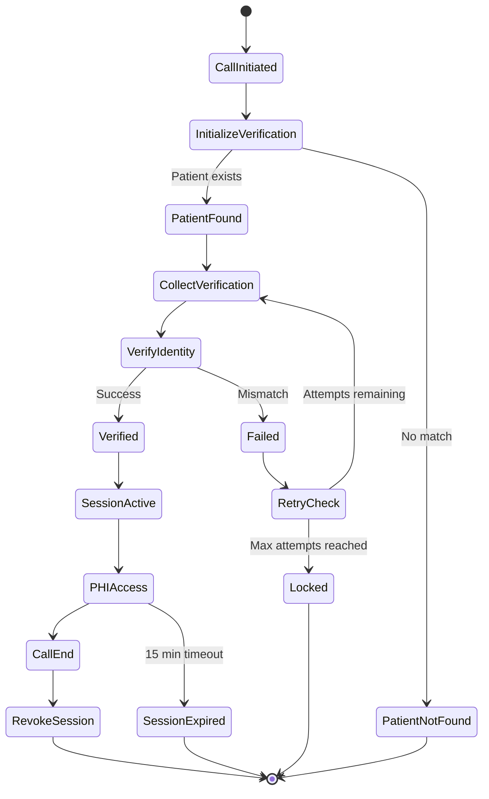

## Overview

Patient verification is the critical security gateway for accessing Protected Health Information (PHI). This guide walks through implementing a secure, HIPAA-compliant verification flow.

<Warning>
  Never skip verification or use shortcuts. Patient safety and privacy depend on proper verification.
</Warning>

## Verification Flow Diagram



## Implementation Steps

### Step 1: Initialize Verification

Start by checking if the patient exists and what verification is required:

<CodeGroup>

```javascript JavaScript
async function initializeVerification(phoneNumber, callSid) {
  const response = await fetch(
    'https://api.kaigo.com/api/v1/admin/patients/initialize-verification',
    {
      method: 'POST',
      headers: {
        'Authorization': `Bearer ${API_TOKEN}`,
        'Content-Type': 'application/json'
      },
      body: JSON.stringify({
        phone_number: phoneNumber,
        call_sid: callSid,
        call_type: 'RPM_OUTBOUND',
        call_direction: 'outbound'
      })
    }
  );

  if (response.status === 429) {
    // Too many attempts - locked out
    const error = await response.json();
    console.log(`Locked until: ${error.locked_until}`);
    return null;
  }

  const data = await response.json();
  return {
    sessionId: data.verification_session_id,
    requiresVerification: data.verification_required,
    attemptsRemaining: data.attempts_remaining
  };
}
```

```python Python
import requests
from datetime import datetime

def initialize_verification(phone_number, call_sid):
    response = requests.post(
        'https://api.kaigo.com/api/v1/admin/patients/initialize-verification',
        headers={
            'Authorization': f'Bearer {API_TOKEN}',
            'Content-Type': 'application/json'
        },
        json={
            'phone_number': phone_number,
            'call_sid': call_sid,
            'call_type': 'RPM_OUTBOUND',
            'call_direction': 'outbound'
        }
    )
    
    if response.status_code == 429:
        # Too many attempts - locked out
        error = response.json()
        print(f"Locked until: {error['locked_until']}")
        return None
    
    data = response.json()
    return {
        'session_id': data['verification_session_id'],
        'requires_verification': data['verification_required'],
        'attempts_remaining': data['attempts_remaining']
    }
```

</CodeGroup>

### Step 2: Collect Verification Data

Based on the requirements, collect the necessary information from the patient:

<Tabs>
  <Tab title="Voice Script">
    ```text
    "For your security and to protect your health information, 
    I need to verify your identity. Can you please tell me:
    
    1. Your full name as it appears in our records?
    2. Your date of birth including the year?"
    ```
  </Tab>
  <Tab title="Data Format">
    ```json
    {
      "name": "John Michael Doe",
      "date_of_birth": "1950-01-15"
    }
    ```
  </Tab>
</Tabs>

### Step 3: Verify Identity

Submit the collected information for verification:

```javascript
async function verifyPatient(sessionId, verificationData) {
  const response = await fetch(
    'https://api.kaigo.com/api/v1/admin/patients/verify-identity',
    {
      method: 'POST',
      headers: {
        'Authorization': `Bearer ${API_TOKEN}`,
        'Content-Type': 'application/json'
      },
      body: JSON.stringify({
        verification_session_id: sessionId,
        verification_data: verificationData
      })
    }
  );

  if (response.status === 410) {
    // Verification failed
    const error = await response.json();
    return {
      success: false,
      attemptsRemaining: error.attempts_remaining,
      nextAllowedAt: error.next_allowed_at
    };
  }

  const data = await response.json();
  return {
    success: true,
    sessionToken: data.patient_session_token,
    patientId: data.patient_id,
    expiresAt: data.expires_at
  };
}
```

### Step 4: Use Session Token

Once verified, use the session token for all PHI access:

```javascript
async function getPatientMedicalInfo(patientId, sessionToken) {
  const response = await fetch(
    `https://api.kaigo.com/api/v1/admin/patients/${patientId}/medical`,
    {
      headers: {
        'Authorization': `Bearer ${API_TOKEN}`,
        'X-Patient-Session': sessionToken
      }
    }
  );

  if (response.status === 410) {
    // Session expired - need to re-verify
    return { expired: true };
  }

  return await response.json();
}
```

### Step 5: Revoke Session

Always revoke the session when the call ends:

```javascript
async function endCall(sessionToken, reason = 'call_completed') {
  await fetch(
    `https://api.kaigo.com/api/v1/admin/sessions/${sessionToken}`,
    {
      method: 'DELETE',
      headers: {
        'Authorization': `Bearer ${API_TOKEN}`
      }
    }
  );
}
```

## Error Handling

### Verification Failures

Handle verification failures gracefully with clear messaging:

<AccordionGroup>
  <Accordion title="First Failure">
    ```text
    "I'm sorry, that information doesn't match our records. 
    Let's try again. Please tell me your full name exactly 
    as it appears on your medical records."
    ```
  </Accordion>
  
  <Accordion title="Second Failure">
    ```text
    "The information still doesn't match. You have 3 more 
    attempts. Please speak slowly and clearly. What is your 
    full legal name?"
    ```
  </Accordion>
  
  <Accordion title="Final Warning">
    ```text
    "This is your final attempt before being temporarily 
    locked out for security. Please carefully state your 
    full name and date of birth."
    ```
  </Accordion>
  
  <Accordion title="Locked Out">
    ```text
    "For security reasons, we've temporarily locked this 
    verification. Please call our support line at 
    1-800-KAIGO-HELP for assistance."
    ```
  </Accordion>
</AccordionGroup>

## Best Practices

### DO's ✅

- **Clear Instructions**: Explain why verification is needed
- **Patient Patience**: Allow time for elderly patients
- **Phonetic Confirmation**: Repeat back for clarity ("That's John, J-O-H-N?")
- **Session Management**: Track expiration times
- **Graceful Failures**: Helpful error messages
- **Audit Everything**: Log all verification attempts

### DON'Ts ❌

- **Never Skip**: Don't bypass verification for "known" patients
- **Don't Hint**: Never provide hints about correct answers
- **Avoid Storage**: Don't store verification answers
- **No Recordings**: Don't record verification data
- **Prevent Sharing**: Never share session tokens between calls

## Common Scenarios

### Scenario 1: Name Variations

```javascript
// Handle common name variations
const normalizeNam = (name) => {
  return name
    .toLowerCase()
    .replace(/[^a-z\s]/g, '') // Remove special chars
    .replace(/\s+/g, ' ')      // Normalize spaces
    .trim();
};

// Server handles variations like:
// "Bob Smith" vs "Robert Smith"
// "Mary Jean" vs "Mary-Jean"
```

### Scenario 2: Date Format Issues

```javascript
// Accept multiple date formats
const parseDateOfBirth = (input) => {
  // Handle formats like:
  // "January 15th, 1950"
  // "01/15/1950"
  // "1950-01-15"
  // "Jan 15 1950"
  
  // Convert to ISO format: YYYY-MM-DD
  return standardizedDate;
};
```

### Scenario 3: Session Extension

```javascript
// Monitor session expiration
const sessionManager = {
  token: null,
  expiresAt: null,
  
  isExpiringSoon() {
    const now = new Date();
    const expiry = new Date(this.expiresAt);
    const minutesLeft = (expiry - now) / 60000;
    return minutesLeft < 2;
  },
  
  async refresh() {
    if (this.isExpiringSoon()) {
      // Re-verify before expiration
      await reverifyPatient();
    }
  }
};
```

## Testing Verification

### Test Cases

<Tabs>
  <Tab title="Happy Path">
    1. Initialize with valid phone number
    2. Provide correct name and DOB
    3. Receive session token
    4. Access PHI successfully
    5. Revoke session on completion
  </Tab>
  
  <Tab title="Failed Verification">
    1. Initialize verification
    2. Provide incorrect information
    3. Verify failure response
    4. Check attempts remaining
    5. Retry with correct info
  </Tab>
  
  <Tab title="Lockout">
    1. Fail verification 5 times
    2. Verify lockout response
    3. Check lockout duration
    4. Attempt after lockout period
  </Tab>
  
  <Tab title="Session Expiry">
    1. Obtain valid session
    2. Wait 15+ minutes
    3. Attempt PHI access
    4. Verify 410 response
    5. Re-verify successfully
  </Tab>
</Tabs>

## Monitoring & Analytics

Track these metrics for verification health:

| Metric | Target | Alert Threshold |
|--------|--------|-----------------|
| Verification Success Rate | Above 95% | Below 90% |
| Average Attempts | Below 1.5 | Above 2.0 |
| Lockout Rate | Below 1% | Above 2% |
| Session Duration | 5-10 min | Above 12 min |
| Re-verification Rate | Below 5% | Above 10% |

## Next Steps

<CardGroup cols={2}>
  <Card
    title="Session Management"
    icon="key"
    href="/guides/session-management"
  >
    Learn about session lifecycle and management
  </Card>
  <Card
    title="Error Handling"
    icon="triangle-exclamation"
    href="/guides/error-handling"
  >
    Handle verification errors gracefully
  </Card>
</CardGroup>