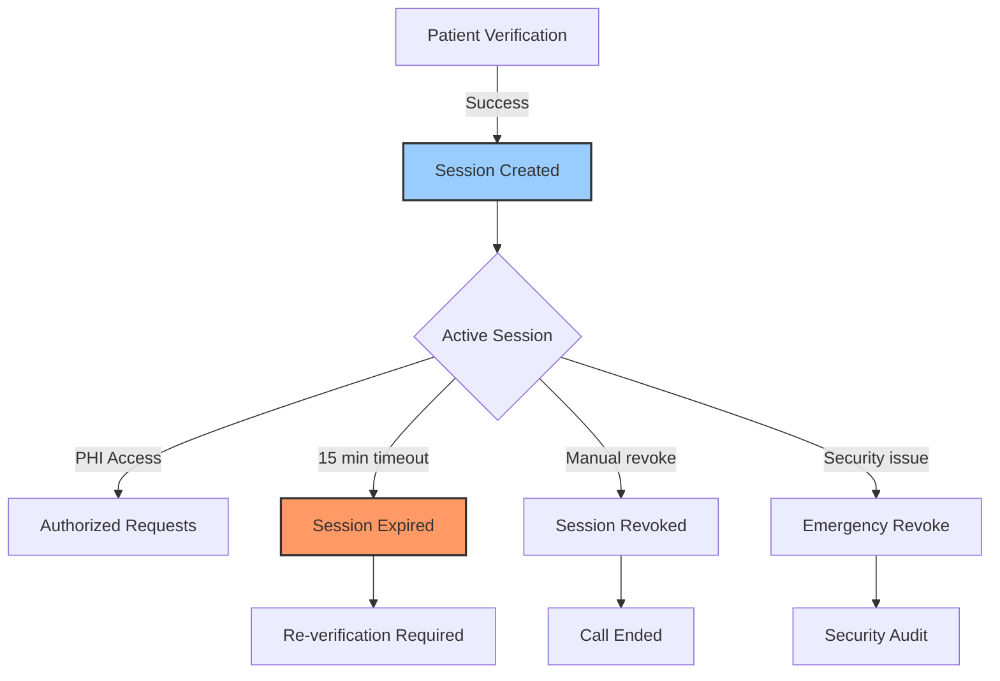

## Overview

Session management is critical for HIPAA-compliant access to Protected Health Information (PHI). Sessions provide time-limited, scoped access to patient data after successful verification.

## Session Lifecycle



## Session Token Structure

Session tokens contain encrypted information about:
- Patient ID
- Call context
- Expiration time
- Access scope
- Verification level

## Creating Sessions

Sessions are created automatically upon successful patient verification:

```javascript
const verifyResponse = await fetch(
  'https://api.kaigo.com/api/v1/admin/patients/verify-identity',
  {
    method: 'POST',
    headers: {
      'Authorization': `Bearer ${API_TOKEN}`,
      'Content-Type': 'application/json'
    },
    body: JSON.stringify({
      verification_session_id: sessionId,
      verification_data: {
        name: 'John Doe',
        date_of_birth: '1950-01-15'
      }
    })
  }
);

const { patient_session_token, expires_at } = await verifyResponse.json();
// Store session token securely for PHI access
```

## Using Session Tokens

Include the session token in the `X-Patient-Session` header for PHI access:

```javascript
const medicalInfo = await fetch(
  `https://api.kaigo.com/api/v1/admin/patients/${patientId}/medical`,
  {
    headers: {
      'Authorization': `Bearer ${API_TOKEN}`,
      'X-Patient-Session': patientSessionToken
    }
  }
);
```

## Session Expiration

### Automatic Expiration
- Sessions expire after **15 minutes** of inactivity
- The `expires_at` timestamp indicates exact expiration
- Expired sessions return `410 Gone` status

### Monitoring Expiration

```javascript
class SessionManager {
  constructor(token, expiresAt) {
    this.token = token;
    this.expiresAt = new Date(expiresAt);
    this.warningThreshold = 2 * 60 * 1000; // 2 minutes
  }

  isExpired() {
    return new Date() >= this.expiresAt;
  }

  isExpiringSoon() {
    const timeLeft = this.expiresAt - new Date();
    return timeLeft > 0 && timeLeft < this.warningThreshold;
  }

  getTimeRemaining() {
    const ms = this.expiresAt - new Date();
    return {
      minutes: Math.floor(ms / 60000),
      seconds: Math.floor((ms % 60000) / 1000)
    };
  }

  async refreshIfNeeded() {
    if (this.isExpiringSoon()) {
      // Trigger re-verification flow
      return await reverifyPatient();
    }
    return this.token;
  }
}
```

## Revoking Sessions

### When to Revoke

Always revoke sessions when:
- Call ends (normal or abnormal)
- Patient requests disconnection
- Suspicious activity detected
- Verification inconsistencies found
- Emergency situations

### Revocation API

```javascript
async function revokeSession(sessionToken, reason) {
  const response = await fetch(
    `https://api.kaigo.com/api/v1/admin/sessions/${sessionToken}`,
    {
      method: 'DELETE',
      headers: {
        'Authorization': `Bearer ${API_TOKEN}`
      }
    }
  );

  const result = await response.json();
  console.log(`Session revoked: ${result.revoked_at}`);
  
  // Log for audit trail
  await logSessionRevocation({
    token: sessionToken,
    reason: reason,
    timestamp: result.revoked_at
  });
}

// Revocation reasons
await revokeSession(token, 'call_completed');
await revokeSession(token, 'patient_request');
await revokeSession(token, 'suspicious_activity');
await revokeSession(token, 'verification_failure');
await revokeSession(token, 'emergency_disconnect');
```

## Session Security

### Storage Best Practices

<Warning>
  Never store session tokens in:
  - Local storage
  - Cookies without HttpOnly flag
  - URL parameters
  - Log files
</Warning>

**Secure Storage Options:**

```javascript
// In-memory storage (preferred for voice agents)
class SecureSessionStore {
  constructor() {
    this.sessions = new Map();
  }

  store(callId, token, expiresAt) {
    this.sessions.set(callId, {
      token: token,
      expiresAt: expiresAt,
      created: new Date()
    });
  }

  get(callId) {
    const session = this.sessions.get(callId);
    if (session && new Date() < new Date(session.expiresAt)) {
      return session.token;
    }
    this.sessions.delete(callId);
    return null;
  }

  revoke(callId) {
    this.sessions.delete(callId);
  }

  cleanup() {
    const now = new Date();
    for (const [callId, session] of this.sessions) {
      if (now >= new Date(session.expiresAt)) {
        this.sessions.delete(callId);
      }
    }
  }
}
```

### Session Validation

Validate sessions on every PHI access:

```javascript
async function validateSession(token, patientId) {
  // Check token format
  if (!token || !token.match(/^[A-Za-z0-9+/=]{100,}$/)) {
    throw new Error('Invalid session token format');
  }

  // Verify token hasn't been revoked
  const isRevoked = await checkRevocationList(token);
  if (isRevoked) {
    throw new Error('Session has been revoked');
  }

  // Verify patient ID matches session scope
  const sessionPatientId = await getSessionPatientId(token);
  if (sessionPatientId !== patientId) {
    throw new Error('Session not authorized for this patient');
  }

  return true;
}
```

## Error Handling

### Session-Related Errors

| Error Code | Status | Description | Action |
|------------|--------|-------------|--------|
| `invalid_session` | 401 | Token invalid or malformed | Re-verify patient |
| `session_expired` | 410 | Token has expired | Re-verify patient |
| `session_mismatch` | 403 | Token doesn't match patient/call | Security audit |
| `session_revoked` | 410 | Token was manually revoked | Cannot recover |

### Error Recovery

```javascript
async function handleSessionError(error, callContext) {
  switch(error.code) {
    case 'session_expired':
      console.log('Session expired, re-verifying...');
      return await reverifyPatient(callContext);
      
    case 'session_mismatch':
      console.error('Security: Session mismatch detected');
      await logSecurityEvent(error, callContext);
      await revokeSession(callContext.token, 'security_violation');
      throw new Error('Security violation - call terminated');
      
    case 'invalid_session':
      console.log('Invalid session, starting fresh verification');
      return await startVerification(callContext);
      
    default:
      console.error('Unexpected session error:', error);
      throw error;
  }
}
```

## Audit Logging

Log all session events for HIPAA compliance:

```javascript
const sessionAuditLog = {
  sessionCreated: (patientId, callId, timestamp) => {
    log({
      event: 'SESSION_CREATED',
      patient_id: patientId,
      call_id: callId,
      timestamp: timestamp,
      success: true
    });
  },
  
  phiAccessed: (patientId, endpoint, sessionToken) => {
    log({
      event: 'PHI_ACCESS',
      patient_id: patientId,
      endpoint: endpoint,
      session_token_hash: hash(sessionToken),
      timestamp: new Date()
    });
  },
  
  sessionRevoked: (sessionToken, reason) => {
    log({
      event: 'SESSION_REVOKED',
      session_token_hash: hash(sessionToken),
      reason: reason,
      timestamp: new Date()
    });
  },
  
  sessionExpired: (sessionToken) => {
    log({
      event: 'SESSION_EXPIRED',
      session_token_hash: hash(sessionToken),
      timestamp: new Date()
    });
  }
};
```

## Best Practices

<Checklist>
  - [ ] Always revoke sessions when calls end
  - [ ] Monitor session expiration proactively
  - [ ] Store tokens securely in memory only
  - [ ] Log all session events for audit trail
  - [ ] Validate sessions before every PHI access
  - [ ] Handle session errors gracefully
  - [ ] Never share sessions between calls
  - [ ] Implement automatic cleanup of expired sessions
</Checklist>

## Next Steps

<CardGroup cols={2}>
  <Card
    title="Patient Verification"
    icon="user-check"
    href="/guides/patient-verification"
  >
    Learn about the verification process
  </Card>
  <Card
    title="Error Handling"
    icon="triangle-exclamation"
    href="/guides/error-handling"
  >
    Handle session errors properly
  </Card>
</CardGroup>