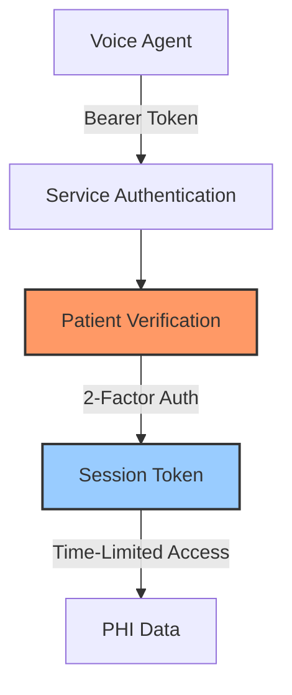

<Note>
  **HIPAA Compliant**: This API implements strict HIPAA security measures including two-factor patient verification, session-based PHI access, and comprehensive audit logging.
</Note>

## Overview

The Kaigo Platform Healthcare API enables secure voice agent interactions for healthcare communication scenarios. Built specifically for Ambi voice agents, our API supports:

- **Remote Patient Monitoring (RPM)** - Automated vital signs collection and symptom tracking
- **Appointment Management** - Reminders, confirmations, and rescheduling
- **Follow-up Care** - Post-visit check-ins and care plan adherence
- **Medication Adherence** - Reminder calls and compliance tracking

## Key Features

<CardGroup cols={2}>
  <Card
    title="HIPAA-Compliant Security"
    icon="shield-halved"
    href="/guides/hipaa-compliance"
  >
    Two-factor verification, encrypted sessions, and audit logging for all PHI access
  </Card>
  <Card
    title="Intelligent Call Management"
    icon="phone"
    href="/guides/call-management"
  >
    Smart scheduling, retry logic, and escalation handling for critical situations
  </Card>
  <Card
    title="Session-Based Access"
    icon="key"
    href="/guides/session-management"
  >
    Secure, time-limited access tokens for PHI with automatic expiration
  </Card>
  <Card
    title="Real-time Escalations"
    icon="triangle-exclamation"
    href="/guides/escalation-handling"
  >
    Automated alerts for critical vitals and emergency situations
  </Card>
</CardGroup>

## API Architecture

### Security Layers



### Data Access Flow

1. **Service Authentication** - Authenticate using bearer token
2. **Patient Verification** - Initialize and complete 2-factor verification
3. **Session Creation** - Receive time-limited session token
4. **PHI Access** - Use session token to access protected health information
5. **Session Management** - Automatic expiration or manual revocation

## Base URLs

<CodeGroup>

```bash Production
https://api.kaigo.com
```

```bash Staging
https://staging-api.kaigo.com
```

</CodeGroup>

## Quick Start

<Steps>
  <Step title="Get API Credentials">
    Contact your Kaigo representative to obtain your API credentials and service ID.
  </Step>
  <Step title="Authenticate Your Service">
    Use your bearer token to authenticate API requests. See [Authentication](/authentication) for details.
  </Step>
  <Step title="Implement Patient Verification">
    Follow our [verification flow](/guides/patient-verification) to securely access patient data.
  </Step>
  <Step title="Make Your First Call">
    Check our [quickstart guide](/quickstart) for a complete example.
  </Step>
</Steps>

## Rate Limits

| Endpoint Type | Rate Limit | Window |
|--------------|------------|---------|
| Verification | 5 attempts | 15 minutes |
| PHI Access | 100 requests | 1 minute |
| General API | 1000 requests | 1 minute |

## Support

<CardGroup cols={2}>
  <Card
    title="API Status"
    icon="signal"
    href="https://status.kaigo.com"
  >
    Check current API status and incidents
  </Card>
  <Card
    title="Contact Support"
    icon="envelope"
    href="mailto:support@kaigo.com"
  >
    Get help from our support team
  </Card>
</CardGroup>